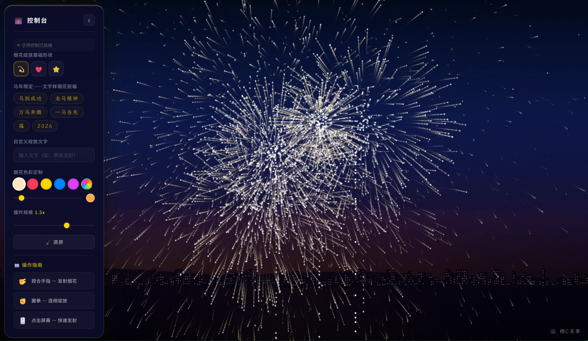

English | **[中文](README.md)**

# 🎆 2026 Year of the Horse — Fireworks Simulator

A gesture-controlled web fireworks simulator built for the 2026 Chinese New Year (Year of the Horse). Pinch your fingers in front of the camera to launch fireworks, or just click anywhere on the screen.



## Live Demo

| Method | URL |
|--------|-----|
| HTTPS (camera gestures supported) | https://58.87.67.161 |
| HTTP (redirects to HTTPS) | http://58.87.67.161:8080 |

> ⚠️ The server uses a self-signed certificate, so your browser will show a security warning. Click **"Advanced"** → **"Proceed"** to continue. Alternatively, clone the repo and open `index.html` locally.

## How to Play

- **Pinch fingers** → Launch a firework
- **Make a fist** → Continuous burst
- **Click the screen** → Works without a camera too

## Features

- Three burst shapes: sphere, heart, star
- Text fireworks: type any text, and the firework explodes into those characters (rendered in Chinese calligraphy font)
- Built-in Year of the Horse blessing phrases, one-click launch
- 8 preset colors + custom hue slider
- Adjustable explosion scale (0.5x ~ 2.0x)
- Dynamic starry sky + city skyline background

## Getting Started

```bash
git clone https://github.com/Trossiyea/Firework_wowow.git
cd Firework_wowow
```

Open `index.html` in your browser. Click anywhere to launch fireworks.

If you want camera gesture control, you'll need a local server:

```bash
# Python
python -m http.server 8080

# Or Node.js
npx serve .
```

Then visit http://localhost:8080

## Tech Stack

Pure frontend, zero build dependencies. Three files:

- `index.html` — page structure
- `style.css` — styles and animations
- `script.js` — particle engine + gesture recognition + UI

External resources (loaded via CDN):
- [MediaPipe Hands](https://google.github.io/mediapipe/solutions/hands.html) — gesture recognition
- [LXGW WenKai](https://github.com/lxgw/LxgwWenKai) — Chinese calligraphy font

## Browser Support

Best experience on Chrome / Edge 90+. Firefox and Safari mostly work, but gesture features may have compatibility issues.

## License

MIT

---

by 橙C美事
